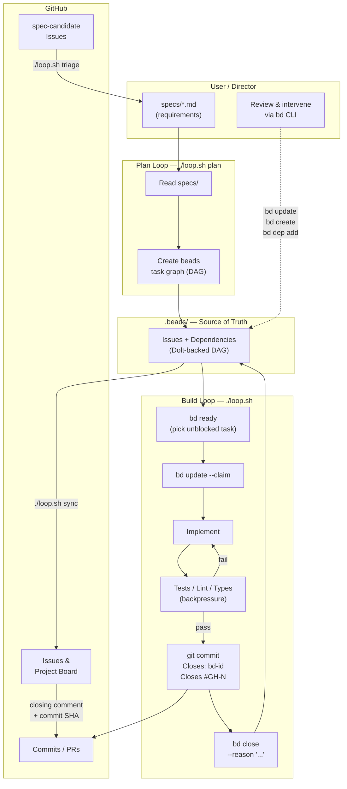

# Ralph-Beads

A unified framework for autonomous AI development combining Geoffrey Huntley's
[Ralph Loop](https://ghuntley.com/loop/) methodology with
[Beads](https://github.com/steveyegge/beads) dependency-aware issue tracking.

## What This Is

Ralph-Beads is a protocol for letting an AI agent build your software autonomously
while you direct it from the outside. You write **what** you want (specs). The
framework handles **how** to break it down, order it, and execute it — one task
at a time, in an infinite loop, with fresh context every iteration.

Your role shifts from writing code to writing requirements, watching the loop,
and tuning when it drifts.

## How It Works

Two concepts combine:

**The Ralph Loop** runs Claude Code in a bash `while` loop. Each iteration gets
fresh context (no hallucination buildup), implements one task, commits, and exits.
The loop restarts for the next task.

**Beads** (`bd`) replaces the original Ralph Loop's flat `IMPLEMENTATION_PLAN.md`
with a proper dependency graph. Tasks know what blocks them. The agent only works
on unblocked tasks. Discovered work gets linked back to its origin.

```
You write specs ──► Plan mode creates task graph ──► Build mode implements tasks
                         (bd issues)                    (one per loop iteration)
```

### Workflow Diagram



| Ralph Loop (original) | Ralph-Beads (this framework) |
|----------------------|------------------------------|
| `IMPLEMENTATION_PLAN.md` flat list | `bd` dependency graph (DAG) |
| LLM picks next task by reading markdown | `bd ready` returns unblocked work |
| No blocker awareness | `blocks` dependencies prevent premature work |
| Manual task discovery | `discovered-from` links capture emergent work |
| Single agent only | `--claim` enables multi-agent coordination |
| Plan drift requires regeneration | Graph stays accurate via atomic updates |

## Layered Architecture

The framework is organized in three optional layers. Each layer builds on the one
below it. You only need the layers you use.

```
┌─────────────────────────────────────────────────────────────┐
│  L2: GitHub Projects Integration (optional)                 │
│      Kanban board sync, column mapping, custom fields       │
│      Requires: L1 + GitHub Project                          │
├─────────────────────────────────────────────────────────────┤
│  L1: GitHub Repository Integration (optional)               │
│      Issue sync, triage, changelog, PR bodies, labels       │
│      Requires: L0 + gh CLI + GitHub repo                    │
├─────────────────────────────────────────────────────────────┤
│  L0: Core (local-only, always required)                     │
│      Ralph Loop + Beads task graph + backpressure           │
│      Requires: bd CLI + AI agent CLI + Dolt                 │
└─────────────────────────────────────────────────────────────┘
```

**L0 — Core** (`specs/core-operating-model.md`): The foundational loop. An AI agent
runs in a `while` loop, claims one task from `bd ready`, implements it, validates
with tests/lint, commits, closes the issue, and exits. The loop restarts with fresh
context. Works entirely offline — no GitHub, no network required.

**L1 — GitHub Repo** (`specs/github-repo-integration.md`): Optional bidirectional
sync between beads and GitHub Issues. `./loop.sh sync` pushes beads state to GitHub;
`./loop.sh triage` pulls `spec-candidate` GitHub Issues into `specs/`. Changelog and
PR body generation from closed beads issues. All via `gh` CLI.

**L2 — GitHub Projects** (`specs/github-projects-integration.md`): Optional kanban
board sync. Beads statuses map to Project columns (Backlog → Ready → In Progress →
Done). Runs as part of `./loop.sh sync` after issue sync. Requires L1.

## Prerequisites

### L0 — Core (required)

- [Claude Code](https://docs.anthropic.com/en/docs/claude-code) CLI — `claude`
  (or [VS Code Copilot](#agent-portability) for agent mode)
- [Beads](https://github.com/steveyegge/beads) CLI — `npm install -g @beads/bd`
- [Dolt](https://github.com/dolthub/dolt) — version-controlled SQL database

### L1 — GitHub Repo (optional)

- Everything from L0
- [GitHub CLI](https://cli.github.com/) — `gh`, authenticated (`gh auth login`)
- A GitHub remote on the repo

### L2 — GitHub Projects (optional)

- Everything from L1
- A GitHub Project (v2) linked to the repo
- `gh` authenticated with project write permissions

## Getting Started

### 1. Install (L0)

```bash
git clone <this-repo>
cd ralph-beads

npm install -g @beads/bd
bd init --prefix myproject
```

### 2. Write Your Specs

Specs go in `specs/`, one file per **topic of concern**. A topic of concern is a
distinct aspect of your project that you can describe in one sentence without using
"and". If you need "and", split it into two specs.

```bash
cat > specs/auth.md << 'EOF'
# Authentication

## Job To Be Done
Users need to sign in with email/password and receive a JWT token.

## Requirements
- POST /auth/login accepts email + password, returns JWT
- Tokens expire after 24 hours
- Invalid credentials return 401
- Passwords are hashed with bcrypt before storage
EOF
```

```bash
cat > specs/user-profile.md << 'EOF'
# User Profile

## Job To Be Done
Authenticated users need to view and update their profile information.

## Requirements
- GET /users/me returns the current user's profile
- PATCH /users/me updates allowed fields (name, avatar)
- Profile changes require valid JWT in Authorization header
EOF
```

**Tips for writing good specs:**
- Be specific about inputs, outputs, and error cases
- Include technical constraints (database, framework, API format)
- State acceptance criteria — how will you know it's done?
- Don't prescribe implementation — say what, not how

### 3. Configure Your Stack

Edit `AGENTS.md` to match your project's build/test/lint commands. This file is
loaded every iteration, so the agent always knows how to validate its work:

```bash
# AGENTS.md — Build & Validate section

# Node.js example
npm test && npm run lint && npm run build

# Rust example
cargo test && cargo clippy && cargo build

# Go example
go test ./... && golangci-lint run
```

Also update the validation commands in `PROMPT_build.md` Phase 3 to match.

### 4. Run the Planning Loop

```bash
./loop.sh plan
```

This reads your specs and creates a dependency-aware task graph in beads. After it
runs, inspect the results:

```bash
bd list --status open     # See all created issues
bd ready                  # See what's unblocked and ready to build
bd dep tree <epic-id>     # Visualize dependency structure
```

**If the plan doesn't look right**, edit your specs and run `./loop.sh plan` again.
Planning iterations are cheap — the agent doesn't write code in this mode.

### 5. Run the Build Loop

```bash
./loop.sh
```

The agent will:
1. Query `bd ready` for the highest-priority unblocked task
2. Claim it (atomic — prevents conflicts)
3. Implement the work
4. Run your test/lint/build validation
5. Commit only if validation passes
6. Close the issue with context
7. Exit — loop restarts with fresh context for the next task

**It stops automatically when:** no ready work remains (all done or all blocked).

### 6. Enable GitHub Integration (L1, optional)

```bash
# Ensure gh is installed and authenticated
gh auth status

# Bootstrap labels on your GitHub repo
./scripts/gh-labels.sh

# Sync beads issues → GitHub Issues (preview first)
./loop.sh sync --dry-run
./loop.sh sync

# Triage spec-candidate GitHub Issues → specs/ (preview first)
./loop.sh triage --dry-run
./loop.sh triage
```

### 7. Enable Project Board (L2, optional)

```bash
# Sync issues to a GitHub Project board
# (creates the project if one doesn't exist)
./scripts/gh-project.sh --dry-run
./scripts/gh-project.sh
```

## How You Direct It

You are the director, not the coder. Here's how you steer:

### Before the Loop

| What you control | How |
|-----------------|-----|
| **What gets built** | Write specs in `specs/` |
| **Build order** | Beads dependencies (set during planning) |
| **Quality gates** | Test/lint/build commands in `AGENTS.md` |
| **Coding standards** | Patterns and constraints in `AGENTS.md` |
| **Agent behavior** | Instructions in `PROMPT_plan.md` / `PROMPT_build.md` |

### During the Loop

| Action | How |
|--------|-----|
| **Watch progress** | `bd list --status open` / `bd ready` |
| **Pause the loop** | `Ctrl+C` between iterations |
| **Skip a stuck task** | `bd close <id> --reason "skipped"` and restart |
| **Add urgent work** | `bd create "Hotfix: ..." -p 0 -t bug` |
| **Re-prioritize** | `bd update <id> --priority 0` |
| **Block something** | `bd dep add <task-id> <blocker-id> --type blocks` |
| **Check what's next** | `bd ready --json` |
| **View full state** | `bd prime` |
| **View iteration logs** | `cat /tmp/ralph-beads-iter-<N>.log` |

### After the Loop

| Action | How |
|--------|-----|
| **Review what was built** | `git log --oneline` |
| **Check remaining work** | `bd list --status open` |
| **Find what's blocked** | `bd list --status open` then `bd dep tree <id>` |
| **Add more specs** | Write new `specs/*.md`, run `./loop.sh plan` again |
| **Sync to GitHub** | `./loop.sh sync` (or `--dry-run` to preview) |
| **Triage GitHub Issues** | `./loop.sh triage` (converts `spec-candidate` issues to specs) |
| **Re-plan from scratch** | Close all issues, write new specs, re-plan |

### Tuning the Agent's Behavior

The framework gives you four "knobs" to turn:

**1. Specs** (`specs/*.md`) — Control *what* gets built. More detailed specs produce
more focused tasks. Vague specs produce vague implementations.

**2. AGENTS.md** — Control *how* the agent works. Add coding standards, known
gotchas, framework-specific patterns. This file accumulates learnings over time.
When the agent makes a mistake, add a note here so it doesn't repeat it.

**3. Prompt files** (`PROMPT_plan.md`, `PROMPT_build.md`) — Control the agent's
*process*. You rarely need to change these, but you can add guardrails (in the
numbered 999+ sections) or adjust phase instructions.

**4. Backpressure** (tests, lint, types) — Control *quality*. The agent cannot commit
code that fails validation. Stronger test suites produce more reliable output.
Write tests manually if needed to raise the quality bar.

### When Things Go Wrong

| Symptom | Fix |
|---------|-----|
| Agent implements the wrong thing | Improve the spec, re-plan |
| Agent keeps failing validation | Check `AGENTS.md` for missing patterns |
| Agent goes in circles | `Ctrl+C`, check the iteration log, add a guardrail to `AGENTS.md` |
| Task graph has wrong ordering | `bd dep add/remove` to fix dependencies |
| Agent works on low-priority stuff | `bd update <id> --priority 0` on the important task |
| Agent discovers too much side work | Add "minimize discovered issues" to `PROMPT_build.md` |
| Plan is stale | Re-run `./loop.sh plan` (cheap — no code changes) |

## Architecture (L0 Core)

```
┌─────────────────────────────────────────────────────────┐
│                     loop.sh                              │
│  while true; do                                          │
│      cat PROMPT_build.md | claude -p                     │
│  done                                                    │
└─────────────┬───────────────────────────────┬───────────┘
              │                               │
              ▼                               ▼
┌─────────────────────┐         ┌─────────────────────────┐
│   AI Agent           │         │   Beads (bd)             │
│   (fresh context)    │◄───────►│   (persistent state)     │
│                      │         │                          │
│   1. bd ready        │         │   ┌───┐  ┌───┐  ┌───┐  │
│   2. bd claim        │         │   │ A │──│ B │──│ C │  │
│   3. implement       │         │   └───┘  └───┘  └───┘  │
│   4. test/lint       │         │   dependency graph      │
│   5. commit          │         │   (DAG)                 │
│   6. bd close        │         │                          │
│   7. exit            │         │   .beads/issues.jsonl   │
└─────────────────────┘         └─────────────────────────┘
```

**Why this works:**
- **Fresh context** each iteration prevents hallucination accumulation
- **Deterministic task selection** via `bd ready` — not LLM guesswork
- **Backpressure** (tests/lint) forces correctness before commits
- **Git-backed state** survives context resets and machine restarts
- **Dependency graph** ensures work happens in the right order

### Steering Model

```
         ┌─────────────────────────────────────────┐
         │          UPSTREAM (you control)          │
         │                                          │
         │  specs/     →  what to build             │
         │  AGENTS.md  →  how to build              │
         │  PROMPT_*.md → agent process             │
         │  code patterns → implementation style    │
         └────────────────────┬────────────────────┘
                              │
                              ▼
                    ┌──────────────────┐
                    │   Claude Code     │
                    │   (one iteration) │
                    └────────┬─────────┘
                              │
                              ▼
         ┌─────────────────────────────────────────┐
         │         DOWNSTREAM (backpressure)        │
         │                                          │
         │  tests     →  correctness                │
         │  linter    →  style compliance            │
         │  types     →  type safety                │
         │  bd ready  →  dependency ordering         │
         └─────────────────────────────────────────┘
```

You push intent **downstream** through specs and standards.
Quality gates push **back upstream** by rejecting bad implementations.
The agent lives in the middle, squeezed into producing correct code.

## File Structure

```
ralph-beads/
├── loop.sh              # Ralph Loop orchestrator
├── PROMPT_plan.md       # Planning mode prompt
├── PROMPT_build.md      # Build mode prompt
├── AGENTS.md            # Operational guide (loaded every iteration)
├── CLAUDE.md            # Claude Code project instructions
├── specs/               # YOUR requirements (one per topic of concern)
│   └── *.md
├── scripts/             # GitHub integration scripts
├── .claude/             # Claude Code adapter
│   └── commands/        # Slash commands (/build, /plan, /status, etc.)
│       └── *.md
├── .github/             # VS Code Copilot adapter
│   ├── copilot-instructions.md          # Global Copilot session context
│   ├── agents/
│   │   ├── beads-pm.agent.md            # Planning agent
│   │   └── beads-dev.agent.md           # Build agent
│   ├── prompts/                         # Slash commands (mirror of .claude/commands/)
│   │   └── *.prompt.md
│   ├── skills/
│   │   ├── beads-triage/SKILL.md        # /beads-triage skill
│   │   ├── beads-create/SKILL.md        # /beads-create skill
│   │   └── beads-workflow/SKILL.md      # /beads-workflow skill
│   └── instructions/
│       └── beads-conventions.instructions.md  # Auto-applied conventions
└── .beads/              # Beads database (managed by bd — don't edit)
    ├── config.yaml
    ├── issues.jsonl     # Git-tracked issue export
    └── dolt/            # Dolt database
```

## Multi-Agent Setup

Run multiple agents in parallel. Beads prevents conflicts via atomic claiming:

```bash
# Terminal 1
BD_ACTOR=agent-1 ./loop.sh

# Terminal 2
BD_ACTOR=agent-2 ./loop.sh
```

Each agent will claim different tasks. If agent-1 claims task A, agent-2 skips it
and picks the next ready task.

## Agent Portability

The framework is agent-neutral — the core protocol (specs → plan → build → close)
works with any AI agent that can run shell commands. This repo ships with adapter
files for two agents:

- **Claude Code** — uses `loop.sh` + `.claude/commands/` for the full Ralph Loop
- **VS Code Copilot** — uses `.github/agents/` and `.github/skills/` for agent mode

If you use GitHub Copilot in VS Code, agent definitions and skills encode the
ralph-beads workflow natively — no `loop.sh` required.

### Prerequisites

- VS Code 1.108.2+ with GitHub Copilot extension
- `bd` CLI on your PATH (verified in the agent's shell environment)
- `.vscode/settings.json` configured for agent mode (included)

### Agents

| Agent | File | Purpose |
|-------|------|---------|
| `beads-pm` | `.github/agents/beads-pm.agent.md` | Planning loop: specs → beads task graph |
| `beads-dev` | `.github/agents/beads-dev.agent.md` | Build loop: claim → implement → validate → commit → close |

Use `@beads-pm` to convert specs into a dependency-ordered task graph.
Use `@beads-dev` to implement the next ready task (one per invocation).

### Skills

| Skill | File | Purpose |
|-------|------|---------|
| `/beads-triage` | `.github/skills/beads-triage/SKILL.md` | Assess and classify new work |
| `/beads-create` | `.github/skills/beads-create/SKILL.md` | Create issues with duplicate checking |
| `/beads-workflow` | `.github/skills/beads-workflow/SKILL.md` | Full claim-implement-close cycle |

### How the Loop Maps to Agent Mode

The Ralph Loop (`while :; do claude -p; done`) becomes **repeated agent invocations**:

| Ralph Loop | VS Code Agent Mode |
|------------|-------------------|
| `loop.sh` iterates automatically | You invoke `@beads-dev` per task |
| Fresh context each iteration | Agent mode provides session isolation |
| `bd ready` picks next task | `@beads-dev` calls `bd ready` itself |
| One-task-per-iteration discipline | Enforced by `beads-dev` agent rules |

**Typical workflow:**

```
1. Write specs in specs/
2. @beads-pm — creates task graph from specs
3. @beads-dev — implements one task, commits, closes
4. Repeat step 3 until bd ready returns empty
```

### File Convention Mapping

Every Claude Code convention file has a VS Code Copilot equivalent:

| Claude Code | VS Code Copilot | Purpose |
|-------------|-----------------|---------|
| `CLAUDE.md` | `.github/copilot-instructions.md` | IDE-wide project instructions, injected into every session |
| `AGENTS.md` | `.github/instructions/beads-conventions.instructions.md` | Always-on conventions: bd CLI, commit format, coding standards |
| `PROMPT_plan.md` | `.github/agents/beads-pm.agent.md` | Planning agent: specs → dependency-aware task graph |
| `PROMPT_build.md` | `.github/agents/beads-dev.agent.md` | Build agent: claim → implement → validate → commit → close |
| `.claude/commands/build.md` | `.github/prompts/build.prompt.md` | `/build` — one build iteration |
| `.claude/commands/plan.md` | `.github/prompts/plan.prompt.md` | `/plan` — specs → task graph |
| `.claude/commands/status.md` | `.github/prompts/status.prompt.md` | `/status` — project status report |
| `.claude/commands/add-spec.md` | `.github/prompts/add-spec.prompt.md` | `/add-spec` — create a new spec file |
| `.claude/commands/create-issue.md` | `.github/prompts/create-issue.prompt.md` | `/create-issue` — file a beads issue |
| *(no equivalent)* | `.github/skills/beads-workflow/SKILL.md` | VS Code skill: full claim-implement-close cycle |
| *(no equivalent)* | `.github/skills/beads-triage/SKILL.md` | VS Code skill: assess and classify new work |
| *(no equivalent)* | `.github/skills/beads-create/SKILL.md` | VS Code skill: create issues with duplicate check |

The dual-file structure lets the framework run identically from both IDEs. `bd` is the
shared state layer — it doesn't care which IDE invoked the agent.

VS Code skills have no direct Claude Code equivalent — in Claude Code, skill behavior
is embedded in the slash commands and `PROMPT_*.md` files rather than standalone skill
definitions.

### Instruction Files

`.github/instructions/beads-conventions.instructions.md` is auto-applied to all
files and encodes bd CLI conventions, commit format, and coding standards.
`.github/copilot-instructions.md` injects the ralph-beads protocol into every
Copilot chat session.

## Adapting for Your Project

1. Update `AGENTS.md` Build & Validate section — uncomment and customize the
   template commands for your project's toolchain (Python, Node, Rust, Go, etc.)
2. Update `PROMPT_build.md` Phase 3 with the same validation commands
3. Add your project's source and test directories
4. Replace `pyproject.toml` with your package manager config (if applicable)

## Concepts & Terminology

| Term | Meaning |
|------|---------|
| **Ralph Loop** | Bash `while` loop feeding prompts to Claude Code |
| **Beads** | Git-backed dependency-aware issue tracker (`bd` CLI) |
| **Spec** | Requirements document in `specs/` — one per topic of concern |
| **Topic of concern** | A distinct project aspect describable in one sentence |
| **Backpressure** | Tests/lint/types that reject bad code before commit |
| **Upstream steering** | Specs, AGENTS.md, prompts — what you write to direct the agent |
| **Downstream steering** | Validation gates that force quality |
| **Discovered work** | Issues the agent finds mid-implementation and files for later |
| **Ready work** | Issues with no unresolved blockers (`bd ready`) |
| **Claiming** | Atomic lock on an issue to prevent multi-agent conflicts |

## Credits

- **Ralph Loop**: [Geoffrey Huntley](https://ghuntley.com/loop/)
- **Ralph Playbook**: [Clayton Farr](https://github.com/ClaytonFarr/ralph-playbook)
- **Beads**: [Steve Yegge](https://github.com/steveyegge/beads)
- **Beads + VS Code Agents**: [mderstine](https://github.com/mderstine/beads-vscode-agents)

## License

MIT
